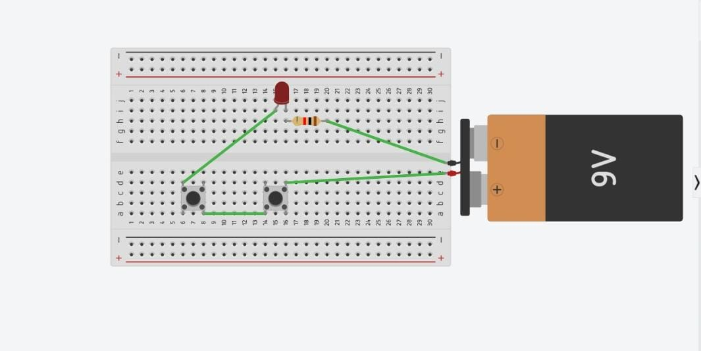
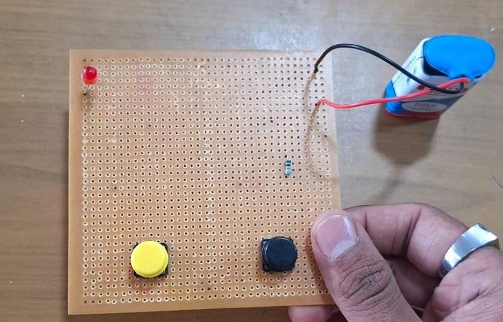

**AND GATE PROJECT**

**Introduction**  
An AND gate is a digital logic gate used to perform the AND operation. The output becomes HIGH only when both input switches are HIGH

**Components Required**  
• 7408 AND Gate IC  
• Breadboard  
• Two Push Buttons  
. LED  
. Resistor  
• Connecting Wires  
. 5V Power Supply

**Circuit Setup**  
The 7408 IC is connected to the breadboard and powered with 5V. Two push buttons are used as inputs, and an LED with a resistor is connected at the output to indicate the result.

**Working Procedure**  
1\. Place the 7408 IC on the breadboard  
2\. Give the required 5V power supply to the IC  
3\. Connect two push buttons to the input terminals  
4\. Connect an LED with a resistor to the output  
5\. Press the switches in different combinations  
6\. Observe the LED for each input condition

**Working**  
• A=0B=0- Output=0  
•A=0,B=1 \- Output \=0  
A \=1,B=0 Output \=0  
•A=1,B=1 \- Output \=1

**Applications**  
• Digital circuits  
. Control systems  
• Computer logic  
• Alarm and safetv circuits  
• Electronic switching systems

**Circuit Diagram**

**Project Image**

****

